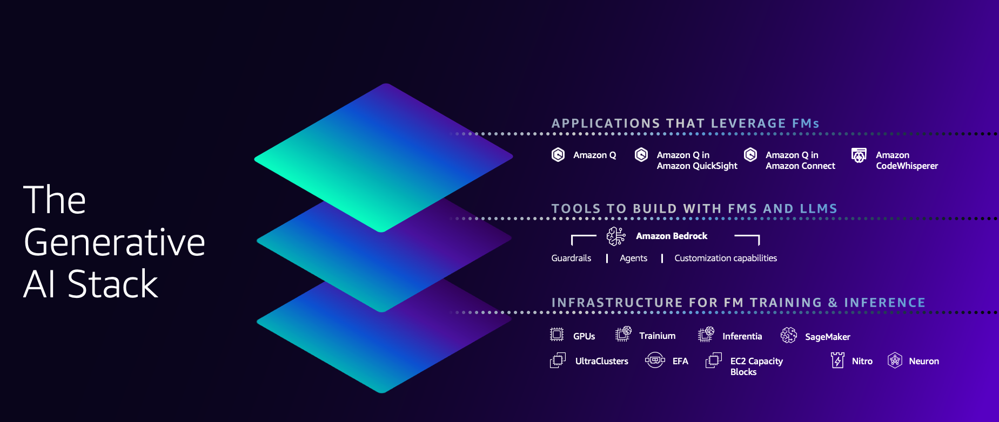

# Building with Generative AI on AWS using PartyRock, Amazon Bedrock, and Amazon Q

This workshop is designed for builders ready to learn about generative AI on AWS. You'll learn to develop applications using PartyRock and Amazon Bedrock, focusing on practical skills like prompt engineering and using different foundational models. We will also explore how to 'chat with your documents' through knowledge bases, retrieval augmented generation (RAG), embeddings, and agents. Additionally, you'll discover how to use next generation developer tools Amazon Q and Amazon CodeWhisperer to assist in coding and debugging.

In this workshop you will complete the following 3 modules:

1. **Build Generative AI Applications with PartyRock:** Learn how to quickly build generative AI applications with no code.

2. **Use Foundation Models in Amazon Bedrock:** Learn how to use various foundation models to generate text and images using Amazon Bedrock.

3. **Chat with your Doucments:** Learn how to use Amazon Bedrock to "Chat with your documents". We will explore how to build RAG applications highlighting knowledge bases, embeddings, and agents.

This is a 300 level workshop, so some familiarly with using services such as AWS Lambda and writing Python code is helpful. No AI/ML experience is necessary. This workshop is intended to be finished within 2 hours.

Here is the link to the [workshop](https://catalog.workshops.aws/building-gen-ai-apps/en-US)

## Security

See [CONTRIBUTING](CONTRIBUTING.md#security-issue-notifications) for more information.

## License

This library is licensed under the MIT-0 License. See the LICENSE file.

